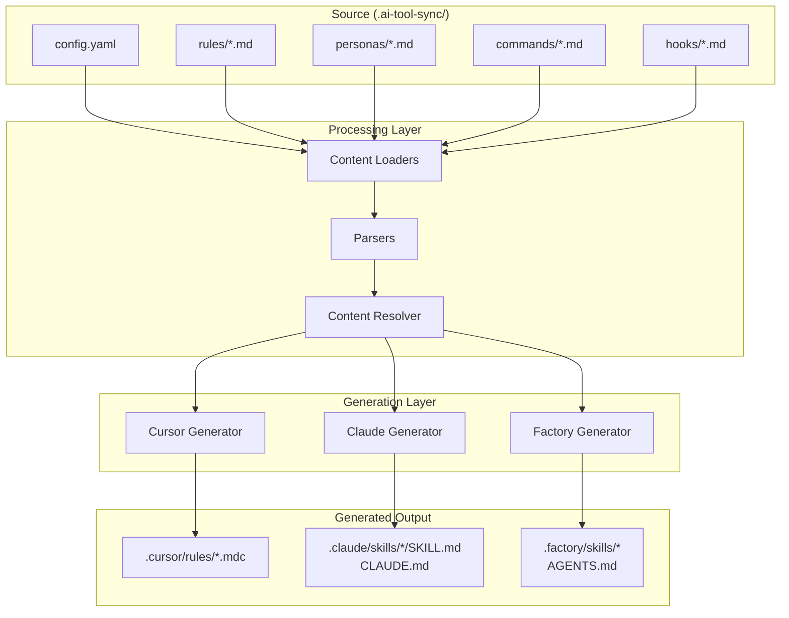
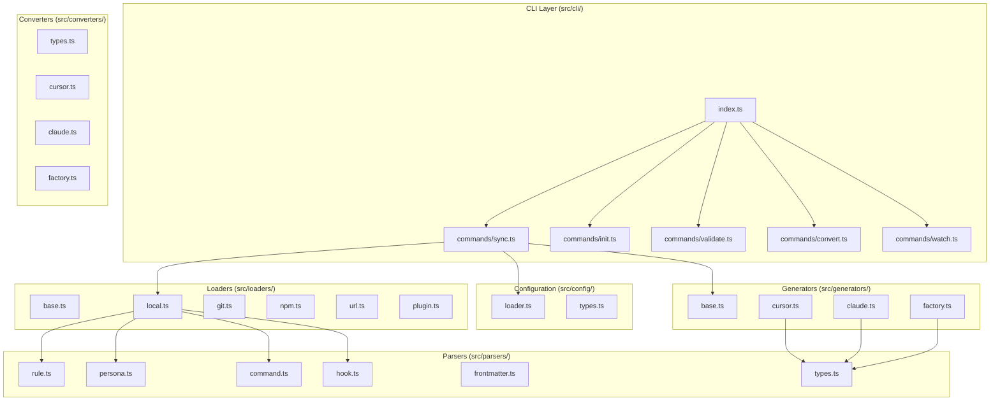

# ai-tool-sync Architecture Overview

This document provides a high-level overview of the ai-tool-sync architecture, a tool for synchronizing AI tool configurations across multiple platforms (Cursor, Claude Code, Factory).

## Core Concept

ai-tool-sync acts as a configuration synchronization layer that transforms a single source of truth into platform-specific outputs.

```text
┌─────────────────────────────────────────────────────────────────────────────┐
│                        SOURCE (.ai-tool-sync/)                              │
├─────────────┬─────────────┬─────────────┬─────────────┬─────────────────────┤
│ config.yaml │  rules/*.md │personas/*.md│commands/*.md│    hooks/*.md       │
└──────┬──────┴──────┬──────┴──────┬──────┴──────┬──────┴──────────┬──────────┘
       │             │             │             │                 │
       └─────────────┴──────┬──────┴─────────────┴─────────────────┘
                            │
                            ▼
       ┌────────────────────────────────────────────────────────────┐
       │                   PROCESSING LAYER                         │
       ├────────────────┬───────────────────┬───────────────────────┤
       │ Content Loaders│     Parsers       │   Content Resolver    │
       └───────┬────────┴─────────┬─────────┴───────────┬───────────┘
               │                  │                     │
               └──────────────────┼─────────────────────┘
                                  │
                                  ▼
       ┌────────────────────────────────────────────────────────────┐
       │                   GENERATION LAYER                         │
       ├──────────────────┬──────────────────┬──────────────────────┤
       │ Cursor Generator │ Claude Generator │  Factory Generator   │
       └────────┬─────────┴────────┬─────────┴──────────┬───────────┘
                │                  │                    │
                ▼                  ▼                    ▼
       ┌────────────────┐ ┌────────────────┐ ┌──────────────────────┐
       │.cursor/rules/  │ │.claude/skills/ │ │ .factory/skills/     │
       │    *.mdc       │ │  CLAUDE.md     │ │   AGENTS.md          │
       └────────────────┘ └────────────────┘ └──────────────────────┘
```



## Module Structure

```text
┌─────────────────────────────────────────────────────────────────────────────┐
│                              CLI LAYER                                      │
│                           (src/cli/)                                        │
├─────────────────────────────────────────────────────────────────────────────┤
│  index.ts ──┬── commands/sync.ts                                            │
│             ├── commands/init.ts                                            │
│             ├── commands/validate.ts                                        │
│             ├── commands/convert.ts                                         │
│             └── commands/watch.ts                                           │
└──────────────────────────────────┬──────────────────────────────────────────┘
                                   │
          ┌────────────────────────┼────────────────────────┐
          │                        │                        │
          ▼                        ▼                        ▼
┌─────────────────────┐  ┌─────────────────────┐  ┌─────────────────────┐
│   CONFIG LAYER      │  │   LOADERS LAYER     │  │  GENERATORS LAYER   │
│   (src/config/)     │  │   (src/loaders/)    │  │  (src/generators/)  │
├─────────────────────┤  ├─────────────────────┤  ├─────────────────────┤
│ • loader.ts         │  │ • base.ts           │  │ • base.ts           │
│ • types.ts          │  │ • local.ts          │  │ • cursor.ts         │
└─────────────────────┘  │ • git.ts            │  │ • claude.ts         │
                         │ • npm.ts            │  │ • factory.ts        │
                         │ • pip.ts            │  └─────────────────────┘
                         │ • url.ts            │
                         │ • plugin.ts         │
                         └──────────┬──────────┘
                                    │
                                    ▼
                         ┌─────────────────────┐
                         │   PARSERS LAYER     │
                         │   (src/parsers/)    │
                         ├─────────────────────┤
                         │ • types.ts          │
                         │ • frontmatter.ts    │
                         │ • rule.ts           │
                         │ • persona.ts        │
                         │ • command.ts        │
                         │ • hook.ts           │
                         │ • mcp.ts            │
                         └─────────────────────┘
```




## Directory Structure

```text
src/
├── cli/                    # Command-line interface
│   ├── index.ts           # CLI entry point (Commander.js)
│   └── commands/          # Individual commands
│       ├── sync.ts        # Main sync operation
│       ├── init.ts        # Project initialization
│       ├── validate.ts    # Config validation
│       ├── convert.ts     # Platform import
│       ├── watch.ts       # File watching
│       ├── status.ts      # Status display
│       ├── clean.ts       # Clean generated files
│       ├── lint.ts        # Lint content files
│       └── plugins.ts     # Plugin management
├── config/                 # Configuration handling
│   ├── types.ts           # Config type definitions
│   └── loader.ts          # Config file loading
├── parsers/                # Content parsers
│   ├── types.ts           # Shared parser types
│   ├── frontmatter.ts     # YAML frontmatter parsing
│   ├── rule.ts            # Rule parser
│   ├── persona.ts         # Persona parser
│   ├── command.ts         # Command parser
│   ├── hook.ts            # Hook parser
│   └── mcp.ts             # MCP config parser
├── loaders/                # Content loaders
│   ├── base.ts            # Loader interface & types
│   ├── local.ts           # Local filesystem loader
│   ├── git.ts             # Git repository loader
│   ├── npm.ts             # NPM package loader
│   ├── pip.ts             # Python package loader
│   ├── url.ts             # URL loader
│   └── plugin.ts          # Plugin orchestrator
├── generators/             # Output generators
│   ├── base.ts            # Generator interface & helpers
│   ├── cursor.ts          # Cursor IDE generator
│   ├── claude.ts          # Claude Code generator
│   ├── factory.ts         # Factory generator
│   └── subfolder-context.ts # Monorepo support
├── converters/             # Platform importers
│   ├── types.ts           # Converter types
│   ├── cursor.ts          # Import from Cursor
│   ├── claude.ts          # Import from Claude
│   └── factory.ts         # Import from Factory
├── transformers/           # Data transformers
│   ├── frontmatter.ts     # Frontmatter serialization
│   ├── model-mapper.ts    # Model name mapping
│   └── tool-mapper.ts     # Tool name mapping
└── utils/                  # Utilities
    ├── fs.ts              # File system helpers
    ├── result.ts          # Result type (Ok/Err)
    └── plugin-cache.ts    # Plugin caching
```

## Key Design Principles

1. **Single Source of Truth**: All AI tool configurations live in `.ai-tool-sync/`
2. **Platform Abstraction**: Generic format with platform-specific extensions
3. **Extensible Loaders**: Support for local, git, npm, pip, and URL sources
4. **Pluggable Generators**: Each target platform has its own generator
5. **Bi-directional Conversion**: Import existing configs via converters
6. **Validation First**: All content validated before generation
7. **Dry-run Support**: Preview changes without writing files

