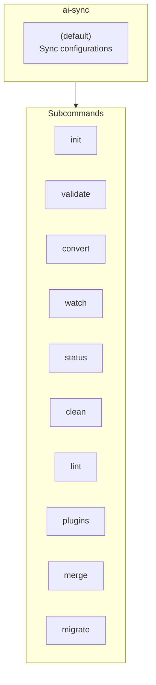
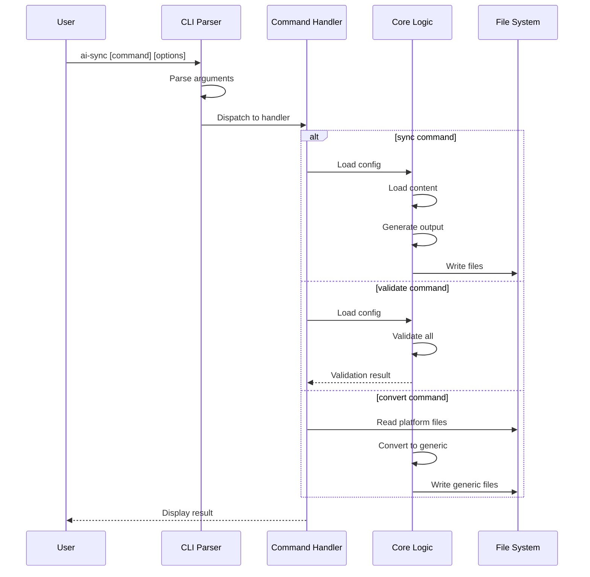

# CLI Commands Architecture

This document describes the CLI command structure and options.

## Command Overview

```text
                              ai-sync
                                 │
           ┌─────────────────────┼─────────────────────┐
           │                     │                     │
           ▼                     ▼                     ▼
    ┌─────────────┐       ┌─────────────┐       ┌─────────────┐
    │  (default)  │       │    init     │       │  validate   │
    │    sync     │       │             │       │             │
    └─────────────┘       └─────────────┘       └─────────────┘
           │
    ┌──────┴──────┬─────────────┬─────────────┬─────────────┐
    │             │             │             │             │
    ▼             ▼             ▼             ▼             ▼
┌─────────┐ ┌─────────┐ ┌─────────┐ ┌─────────┐ ┌─────────┐
│ convert │ │  watch  │ │ status  │ │  clean  │ │  lint   │
└─────────┘ └─────────┘ └─────────┘ └─────────┘ └─────────┘
    │
    ▼
┌─────────┐ ┌─────────┐
│ plugins │ │ migrate │
└─────────┘ └─────────┘
```



## Command Details

### ai-sync (default)

Generate tool-specific configurations from `.ai-tool-sync/` sources.

```text
ai-sync [options]

Options:
  -v, --verbose             Enable verbose output
  -d, --dry-run             Preview changes without writing files
  --no-clean                Keep existing generated files
  -p, --project <path>      Use a different project root
  -c, --config-dir <path>   Configuration directory name (default: .ai-tool-sync)
```

### ai-sync init

Initialize a new configuration directory.

```text
ai-sync init [options]

Options:
  -f, --force               Overwrite existing configuration
  -p, --project <path>      Use a different project root
  -c, --config-dir <path>   Configuration directory name
```

### ai-sync validate

Validate configuration without generating output.

```text
ai-sync validate [options]

Options:
  -v, --verbose             Show detailed validation results
  -p, --project <path>      Use a different project root
  -c, --config-dir <path>   Configuration directory name
```

### ai-sync convert

Import existing platform configurations.

```text
ai-sync convert [options]

Options:
  --platform <name>         Source platform (cursor, claude, factory)
  --output <path>           Output directory
  --overwrite               Overwrite existing files
```

### ai-sync watch

Watch for changes and auto-sync.

```text
ai-sync watch [options]

Options:
  --debounce <ms>           Debounce delay (default: 300)
  -p, --project <path>      Use a different project root
  -c, --config-dir <path>   Configuration directory name
```

## Command Flow

```text
User                    CLI Parser           Command Handler         Core Logic
  │                         │                      │                     │
  │  ai-sync [cmd] [opts]   │                      │                     │
  │────────────────────────▶│                      │                     │
  │                         │                      │                     │
  │                         │  Parse arguments     │                     │
  │                         │──────────────────────│                     │
  │                         │                      │                     │
  │                         │  Dispatch to handler │                     │
  │                         │─────────────────────▶│                     │
  │                         │                      │                     │
  │                         │                      │  ┌───────────────────────┐
  │                         │                      │  │ sync command:         │
  │                         │                      │  │   Load config         │
  │                         │                      │  │   Load content        │
  │                         │                      │  │   Generate output     │
  │                         │                      │──│   Write files         │
  │                         │                      │  └───────────────────────┘
  │                         │                      │                     │
  │                         │                      │  ┌───────────────────────┐
  │                         │                      │  │ validate command:     │
  │                         │                      │  │   Load config         │
  │                         │                      │──│   Validate all        │
  │                         │                      │  │   Return result       │
  │                         │                      │  └───────────────────────┘
  │                         │                      │                     │
  │                         │                      │  ┌───────────────────────┐
  │                         │                      │  │ convert command:      │
  │                         │                      │  │   Read platform files │
  │                         │                      │──│   Convert to generic  │
  │                         │                      │  │   Write generic files │
  │                         │                      │  └───────────────────────┘
  │                         │                      │                     │
  │  Display result         │                      │                     │
  │◀────────────────────────────────────────────────                     │
  │                         │                      │                     │
```



## Global Options

These options are available for all commands:

| Option | Short | Description |
|--------|-------|-------------|
| `--project` | `-p` | Project root directory |
| `--config-dir` | `-c` | Config directory name |
| `--verbose` | `-v` | Enable verbose output |
| `--help` | `-h` | Show help |
| `--version` | | Show version |

## Exit Codes

| Code | Meaning |
|------|---------|
| 0 | Success |
| 1 | General error |
| 2 | Validation error |
| 3 | Configuration error |
| 4 | File system error |

## Configuration Priority

```text
    HIGHEST PRIORITY
         │
         ▼
┌─────────────────────┐
│   CLI Arguments     │  --project, --config-dir, etc.
└──────────┬──────────┘
           │
           ▼
┌─────────────────────┐
│ Environment Vars    │  AI_TOOL_SYNC_DIR, etc.
└──────────┬──────────┘
           │
           ▼
┌─────────────────────┐
│   package.json      │  "ai-tool-sync": { "configDir": ".ai" }
└──────────┬──────────┘
           │
           ▼
┌─────────────────────┐
│   Default Values    │  .ai-tool-sync/
└─────────────────────┘
         │
         ▼
    LOWEST PRIORITY
```