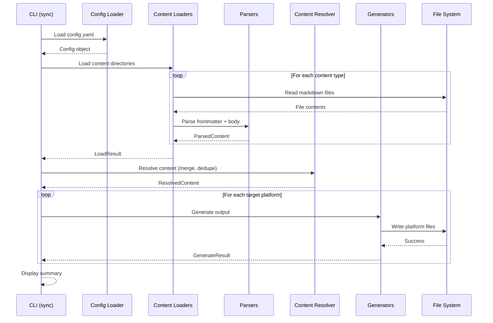
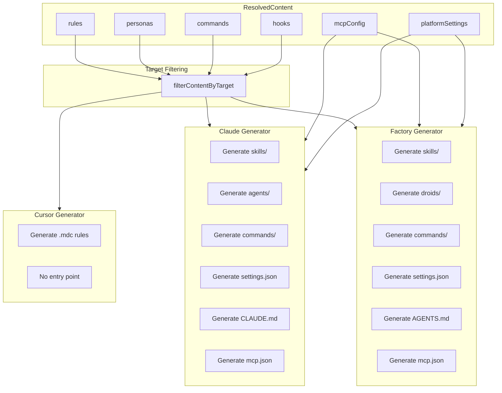
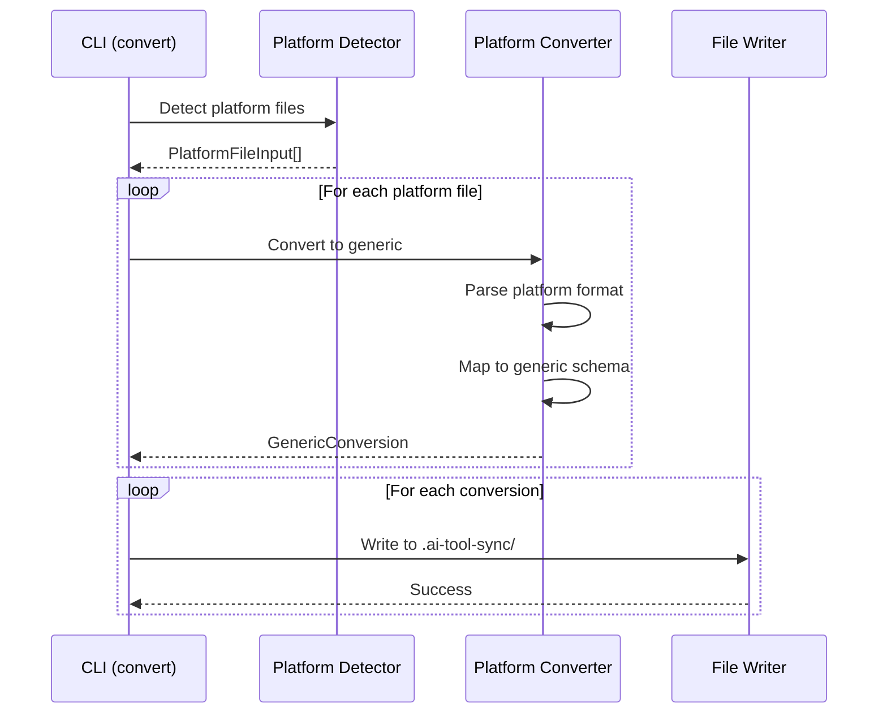
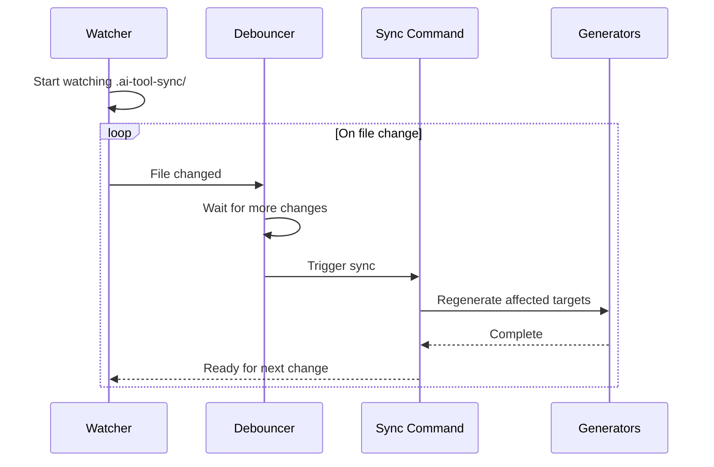

# Data Flow Architecture

This document describes how data flows through the ai-tool-sync system during different operations.

## Sync Operation Flow

The main sync operation follows this sequence:

```text
┌──────────┐     ┌──────────────┐     ┌─────────────────┐     ┌────────────────┐
│   CLI    │────▶│ Config Loader│────▶│ Content Loaders │────▶│    Parsers     │
│ (sync)   │     │              │     │                 │     │                │
└──────────┘     └──────────────┘     └─────────────────┘     └───────┬────────┘
                                                                      │
     ┌────────────────────────────────────────────────────────────────┘
     │
     ▼
┌────────────────┐     ┌─────────────────┐     ┌──────────────────────┐
│Content Resolver│────▶│   Generators    │────▶│    File System       │
│  (merge/dedupe)│     │ (per platform)  │     │  (write outputs)     │
└────────────────┘     └─────────────────┘     └──────────────────────┘
```

```text
CLI (sync)          Config Loader      Content Loaders       Parsers          Generators        File System
    │                    │                   │                  │                 │                 │
    │  Load config.yaml  │                   │                  │                 │                 │
    │───────────────────▶│                   │                  │                 │                 │
    │                    │                   │                  │                 │                 │
    │   Config object    │                   │                  │                 │                 │
    │◀───────────────────│                   │                  │                 │                 │
    │                    │                   │                  │                 │                 │
    │         Load content directories       │                  │                 │                 │
    │───────────────────────────────────────▶│                  │                 │                 │
    │                    │                   │                  │                 │                 │
    │                    │                   │  Read *.md files │                 │                 │
    │                    │                   │─────────────────▶│                 │                 │
    │                    │                   │                  │                 │                 │
    │                    │                   │  ParsedContent[] │                 │                 │
    │                    │                   │◀─────────────────│                 │                 │
    │                    │                   │                  │                 │                 │
    │              LoadResult                │                  │                 │                 │
    │◀───────────────────────────────────────│                  │                 │                 │
    │                    │                   │                  │                 │                 │
    │                    │                   │                  │                 │                 │
    │                           Generate for each target platform                 │                 │
    │────────────────────────────────────────────────────────────────────────────▶│                 │
    │                    │                   │                  │                 │                 │
    │                    │                   │                  │                 │  Write files    │
    │                    │                   │                  │                 │────────────────▶│
    │                    │                   │                  │                 │                 │
    │                    │                   │                  │                 │    Success      │
    │                    │                   │                  │                 │◀────────────────│
    │                    │                   │                  │                 │                 │
    │                                   GenerateResult                            │                 │
    │◀────────────────────────────────────────────────────────────────────────────│                 │
    │                    │                   │                  │                 │                 │
```



## Content Loading Pipeline

```text
                              INPUT SOURCES
    ┌───────────────────┬───────────────────┬───────────────────┐
    │ Local             │ Built-in          │ External          │
    │ .ai-tool-sync/    │ Defaults          │ Plugins           │
    └─────────┬─────────┴─────────┬─────────┴─────────┬─────────┘
              │                   │                   │
              ▼                   ▼                   ▼
    ┌─────────────────────────────────────────────────────────────┐
    │                     CONTENT LOADERS                         │
    ├───────────┬───────────┬───────────┬───────────┬─────────────┤
    │LocalLoader│ GitLoader │ NpmLoader │ PipLoader │  UrlLoader  │
    └─────┬─────┴─────┬─────┴─────┬─────┴─────┬─────┴──────┬──────┘
          │           │           │           │            │
          └───────────┴───────────┼───────────┴────────────┘
                                  │
                                  ▼
    ┌─────────────────────────────────────────────────────────────┐
    │                    PARSING PIPELINE                         │
    ├─────────────────────────────────────────────────────────────┤
    │  ┌──────────────┐  ┌──────────────┐  ┌──────────────┐       │
    │  │  Frontmatter │─▶│  Validation  │─▶│   Apply      │       │
    │  │    Parser    │  │              │  │   Defaults   │       │
    │  └──────────────┘  └──────────────┘  └──────────────┘       │
    └────────────────────────────┬────────────────────────────────┘
                                 │
                                 ▼
    ┌─────────────────────────────────────────────────────────────┐
    │                       LOAD RESULT                           │
    ├───────────────┬───────────────┬───────────────┬─────────────┤
    │ ParsedRule[]  │ParsedPersona[]│ParsedCommand[]│ParsedHook[] │
    └───────────────┴───────────────┴───────────────┴─────────────┘
```

```mermaid
flowchart TB
    subgraph Input["Input Sources"]
        LOCAL[Local .ai-tool-sync/]
        DEFAULTS[Built-in Defaults]
        PLUGINS[External Plugins]
    end
    
    subgraph Loaders["Content Loaders"]
        L_LOCAL[LocalLoader]
        L_GIT[GitLoader]
        L_NPM[NpmLoader]
        L_PIP[PipLoader]
        L_URL[UrlLoader]
    end
    
    subgraph Parsing["Parsing Pipeline"]
        FM[Frontmatter Parser]
        VAL[Validation]
        DEF[Apply Defaults]
    end
    
    subgraph Output["LoadResult"]
        RULES[ParsedRule[]]
        PERSONAS[ParsedPersona[]]
        COMMANDS[ParsedCommand[]]
        HOOKS[ParsedHook[]]
    end
    
    LOCAL --> L_LOCAL
    DEFAULTS --> L_LOCAL
    PLUGINS --> L_GIT
    PLUGINS --> L_NPM
    PLUGINS --> L_PIP
    PLUGINS --> L_URL
    
    L_LOCAL --> FM
    L_GIT --> FM
    L_NPM --> FM
    L_PIP --> FM
    L_URL --> FM
    
    FM --> VAL
    VAL --> DEF
    
    DEF --> RULES
    DEF --> PERSONAS
    DEF --> COMMANDS
    DEF --> HOOKS
```

## Generation Pipeline

```text
                            RESOLVED CONTENT
    ┌─────────────────────────────────────────────────────────────┐
    │ rules │ personas │ commands │ hooks │ mcpConfig │ settings  │
    └───────────────────────────┬─────────────────────────────────┘
                                │
                                ▼
    ┌─────────────────────────────────────────────────────────────┐
    │                  filterContentByTarget()                    │
    │            (filters by targets: [] in frontmatter)          │
    └───────────────────────────┬─────────────────────────────────┘
                                │
          ┌─────────────────────┼─────────────────────┐
          │                     │                     │
          ▼                     ▼                     ▼
    ┌───────────────┐   ┌───────────────┐   ┌───────────────────┐
    │    CURSOR     │   │    CLAUDE     │   │     FACTORY       │
    │   GENERATOR   │   │   GENERATOR   │   │    GENERATOR      │
    ├───────────────┤   ├───────────────┤   ├───────────────────┤
    │ • .mdc rules  │   │ • skills/     │   │ • skills/         │
    │               │   │ • agents/     │   │ • droids/         │
    │               │   │ • commands/   │   │ • commands/       │
    │               │   │ • settings.json   │ • settings.json   │
    │               │   │ • CLAUDE.md   │   │ • AGENTS.md       │
    │               │   │ • mcp.json    │   │ • mcp.json        │
    └───────┬───────┘   └───────┬───────┘   └─────────┬─────────┘
            │                   │                     │
            ▼                   ▼                     ▼
    ┌───────────────┐   ┌───────────────┐   ┌───────────────────┐
    │.cursor/rules/ │   │   .claude/    │   │    .factory/      │
    │   *.mdc       │   │   CLAUDE.md   │   │    AGENTS.md      │
    └───────────────┘   └───────────────┘   └───────────────────┘
```



## Convert Operation Flow

```text
CLI (convert)        Platform Detector      Converter           File Writer
    │                      │                    │                    │
    │  Scan for platform   │                    │                    │
    │  files               │                    │                    │
    │─────────────────────▶│                    │                    │
    │                      │                    │                    │
    │  PlatformFileInput[] │                    │                    │
    │◀─────────────────────│                    │                    │
    │                      │                    │                    │
    │     ┌────────────────────────────────────────────────────┐    │
    │     │  For each platform file:                           │    │
    │     │                                                    │    │
    │     │     Convert to generic                             │    │
    │     │ ───────────────────────▶│                          │    │
    │     │                         │                          │    │
    │     │                         │  Parse platform format   │    │
    │     │                         │  Map to generic schema   │    │
    │     │                         │                          │    │
    │     │     GenericConversion   │                          │    │
    │     │ ◀───────────────────────│                          │    │
    │     │                         │                          │    │
    │     └────────────────────────────────────────────────────┘    │
    │                      │                    │                    │
    │     Write to .ai-tool-sync/              │                    │
    │───────────────────────────────────────────────────────────────▶│
    │                      │                    │                    │
    │     Success          │                    │                    │
    │◀───────────────────────────────────────────────────────────────│
```



## File Processing Flow

```text
┌────────────────┐     ┌────────────────┐     ┌────────────────┐
│  Markdown File │────▶│   Raw Content  │────▶│ Split FM/Body  │
└────────────────┘     └────────────────┘     └───────┬────────┘
                                                      │
     ┌────────────────────────────────────────────────┘
     │
     ▼
┌────────────────┐     ┌────────────────┐     ┌────────────────┐
│   Parse YAML   │────▶│    Validate    │────▶│ Apply Defaults │
│   Frontmatter  │     │    Schema      │     │                │
└────────────────┘     └────────────────┘     └───────┬────────┘
                                                      │
     ┌────────────────────────────────────────────────┘
     │
     ▼
┌────────────────┐     ┌────────────────┐
│Apply Extensions│────▶│ ParsedContent  │
│   (platform)   │     │    Output      │
└────────────────┘     └────────────────┘
```



```mermaid
flowchart LR
    subgraph Read["Read Phase"]
        FILE[Markdown File]
        RAW[Raw Content]
    end
    
    subgraph Parse["Parse Phase"]
        SPLIT[Split Frontmatter/Body]
        YAML[Parse YAML]
        VALIDATE[Validate Schema]
    end
    
    subgraph Transform["Transform Phase"]
        DEFAULTS[Apply Defaults]
        EXTEND[Apply Extensions]
        RESOLVE[Resolve References]
    end
    
    subgraph Output["Output Phase"]
        PARSED[ParsedContent]
    end
    
    FILE --> RAW
    RAW --> SPLIT
    SPLIT --> YAML
    YAML --> VALIDATE
    VALIDATE --> DEFAULTS
    DEFAULTS --> EXTEND
    EXTEND --> RESOLVE
    RESOLVE --> PARSED
```

## Watch Mode Flow

```text
┌─────────────┐                          ┌─────────────┐
│   Watcher   │                          │   Sync      │
│  (chokidar) │                          │   Command   │
└──────┬──────┘                          └──────┬──────┘
       │                                        │
       │  Start watching .ai-tool-sync/         │
       │◀───────────────────────────────────────│
       │                                        │
       │  ┌─────────────────────────────────────────────┐
       │  │  On file change:                            │
       │  │                                             │
       │  │  File changed                               │
       │  │────────────────▶  Debouncer                 │
       │  │                      │                      │
       │  │                      │ Wait 300ms           │
       │  │                      │ (collect more)       │
       │  │                      │                      │
       │  │                      │ Trigger sync         │
       │  │                      │─────────────────────▶│
       │  │                      │                      │
       │  │                      │                      │ Regenerate
       │  │                      │                      │────────────▶
       │  │                      │                      │
       │  │                      │◀─────────────────────│ Complete
       │  │                                             │
       │  └─────────────────────────────────────────────┘
       │                                        │
```


