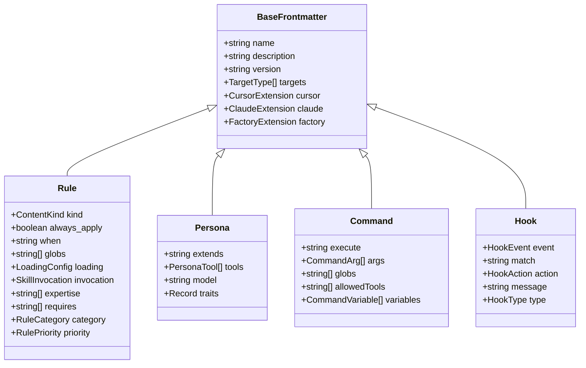
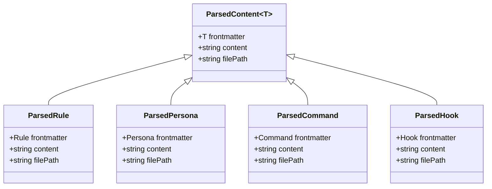
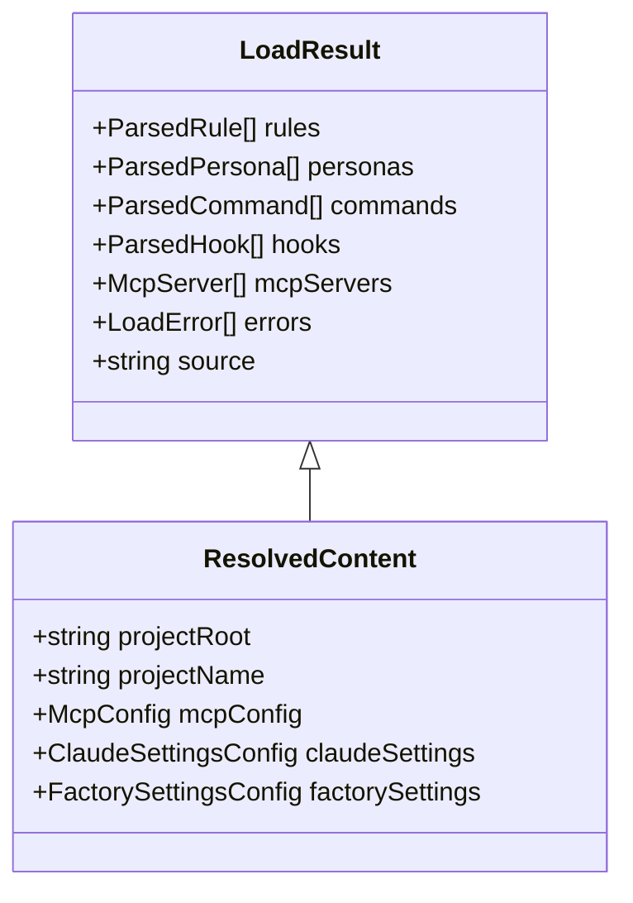
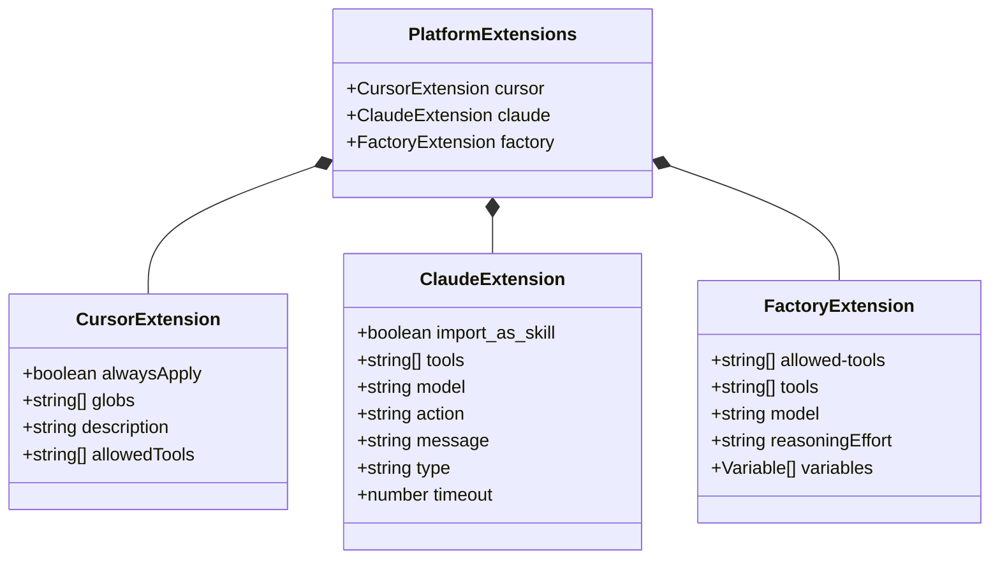
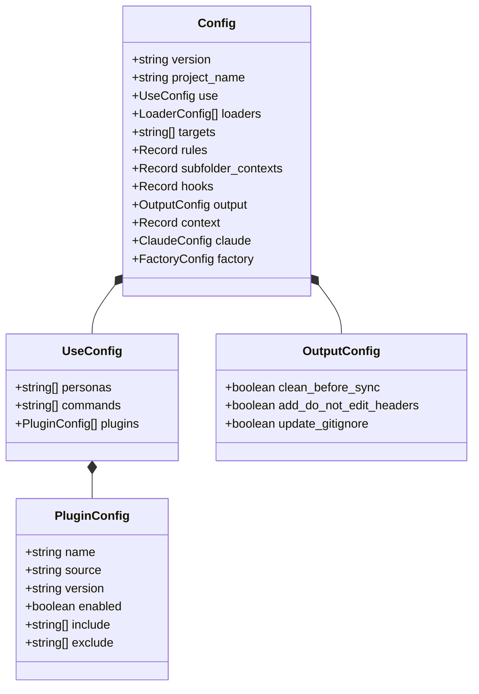

# Core Data Structures

This document describes the key data structures used throughout ai-tool-sync.

## Content Type Hierarchy

ai-tool-sync manages four primary content types, all extending a common base:

```text
                    ┌─────────────────────────────────┐
                    │        BaseFrontmatter          │
                    ├─────────────────────────────────┤
                    │ + name: string                  │
                    │ + description?: string          │
                    │ + version?: string              │
                    │ + targets?: TargetType[]        │
                    │ + cursor?: CursorExtension      │
                    │ + claude?: ClaudeExtension      │
                    │ + factory?: FactoryExtension    │
                    └───────────────┬─────────────────┘
                                    │
        ┌───────────────┬───────────┴───────────┬───────────────┐
        │               │                       │               │
        ▼               ▼                       ▼               ▼
┌───────────────┐ ┌───────────────┐ ┌───────────────────┐ ┌───────────────┐
│     Rule      │ │    Persona    │ │      Command      │ │     Hook      │
├───────────────┤ ├───────────────┤ ├───────────────────┤ ├───────────────┤
│ + kind?       │ │ + extends?    │ │ + execute?        │ │ + event       │
│ + always_apply│ │ + tools?      │ │ + args?           │ │ + match?      │
│ + when?       │ │ + model?      │ │ + globs?          │ │ + action?     │
│ + globs?      │ │ + traits?     │ │ + allowedTools?   │ │ + message?    │
│ + loading?    │ └───────────────┘ │ + variables?      │ │ + type?       │
│ + invocation? │                   └───────────────────┘ └───────────────┘
│ + expertise?  │
│ + requires?   │
│ + category?   │
│ + priority?   │
└───────────────┘
```



## Parsed Content Wrapper

All parsed content is wrapped in a generic structure:

```text
┌─────────────────────────────────────────────────────────────────┐
│                    ParsedContent<T>                             │
├─────────────────────────────────────────────────────────────────┤
│ + frontmatter: T        // Parsed YAML metadata                 │
│ + content: string       // Markdown body                        │
│ + filePath?: string     // Source file path                     │
└─────────────────────────────────────────────────────────────────┘
                                    │
        ┌───────────────┬───────────┴───────────┬───────────────┐
        │               │                       │               │
        ▼               ▼                       ▼               ▼
  ParsedRule      ParsedPersona         ParsedCommand      ParsedHook
```



## LoadResult Structure

Content loaders return this unified result:

```text
┌─────────────────────────────────────────────────────────────────┐
│                        LoadResult                               │
├─────────────────────────────────────────────────────────────────┤
│ + rules: ParsedRule[]                                           │
│ + personas: ParsedPersona[]                                     │
│ + commands: ParsedCommand[]                                     │
│ + hooks: ParsedHook[]                                           │
│ + mcpServers?: Record<string, McpServer>                        │
│ + errors?: LoadError[]                                          │
│ + source?: string                                               │
└───────────────────────────────────┬─────────────────────────────┘
                                    │
                                    │ extends
                                    ▼
┌─────────────────────────────────────────────────────────────────┐
│                      ResolvedContent                            │
├─────────────────────────────────────────────────────────────────┤
│ + projectRoot: string                                           │
│ + projectName?: string                                          │
│ + mcpConfig?: McpConfig                                         │
│ + claudeSettings?: ClaudeSettingsConfig                         │
│ + factorySettings?: FactorySettingsConfig                       │
└─────────────────────────────────────────────────────────────────┘
```



## Platform Extensions

Each content type can have platform-specific overrides:

```text
┌─────────────────────────────────────────────────────────────────────────────┐
│                          PlatformExtensions                                 │
└─────────────────────────────────────────────────────────────────────────────┘
        │                         │                         │
        ▼                         ▼                         ▼
┌─────────────────┐     ┌─────────────────┐     ┌─────────────────────┐
│ CursorExtension │     │ ClaudeExtension │     │  FactoryExtension   │
├─────────────────┤     ├─────────────────┤     ├─────────────────────┤
│ + alwaysApply?  │     │ + import_as_    │     │ + allowed-tools?    │
│ + globs?        │     │     skill?      │     │ + tools?            │
│ + description?  │     │ + tools?        │     │ + model?            │
│ + allowedTools? │     │ + model?        │     │ + reasoningEffort?  │
└─────────────────┘     │ + action?       │     │ + variables?        │
                        │ + message?      │     └─────────────────────┘
                        │ + type?         │
                        │ + timeout?      │
                        └─────────────────┘
```



## Type Enumerations

### Target Types

```typescript
type TargetType = 'cursor' | 'claude' | 'factory';
```

### Content Kind

```typescript
type ContentKind = 'policy' | 'skill';
// policy: Static, must-do constraints (always_apply or glob-triggered)
// skill: Dynamic, context-invoked capabilities (semantic or explicit)
```

### Loading Strategies

```typescript
type LoadingStrategy = 'glob' | 'always' | 'semantic' | 'explicit';
// glob: Load when file matches glob patterns
// always: Always load regardless of context
// semantic: AI determines when to load based on relevance
// explicit: Only load when explicitly invoked
```

### Rule Priority

```typescript
type RulePriority = 'low' | 'medium' | 'high';
```

### Rule Categories

```typescript
type RuleCategory = 
  | 'core'           // Core project rules
  | 'infrastructure' // Infrastructure/DevOps rules
  | 'testing'        // Testing-related rules
  | 'security'       // Security rules
  | 'documentation'  // Documentation rules
  | 'tooling'        // Tool configuration rules
  | 'other';         // Miscellaneous rules
```

### Persona Tools

```typescript
type PersonaTool = 
  | 'read'    // Read files
  | 'write'   // Write files
  | 'edit'    // Edit files
  | 'execute' // Execute commands
  | 'search'  // Search codebase
  | 'glob'    // Glob file matching
  | 'fetch'   // Fetch URLs
  | 'ls';     // List directories
```

### Hook Events

```typescript
type HookEvent =
  | 'PreToolUse'       // Before tool execution
  | 'PostToolUse'      // After tool execution
  | 'UserPromptSubmit' // When user submits prompt
  | 'Notification'     // System notifications
  | 'Stop'             // Agent termination
  | 'SubagentStop'     // Sub-agent termination
  | 'SessionStart'     // Session begins
  | 'SessionEnd'       // Session ends
  | 'PreCompact';      // Before context compaction
```

## Configuration Types

```text
┌─────────────────────────────────────────────────────────────────┐
│                           Config                                │
├─────────────────────────────────────────────────────────────────┤
│ + version: string                                               │
│ + project_name?: string                                         │
│ + use?: UseConfig ─────────────────────────────────────────┐    │
│ + loaders?: LoaderConfig[]                                 │    │
│ + targets?: string[]                                       │    │
│ + rules?: Record<string, RuleConfig>                       │    │
│ + subfolder_contexts?: Record<string, SubfolderConfig>     │    │
│ + hooks?: Record<string, HookConfig[]>                     │    │
│ + output?: OutputConfig                                    │    │
│ + context?: Record<string, string|number|boolean>          │    │
│ + claude?: ClaudeConfig                                    │    │
│ + factory?: FactoryConfig                                  │    │
└────────────────────────────────────────────────────────────┼────┘
                                                             │
                         ┌───────────────────────────────────┘
                         ▼
              ┌─────────────────────┐
              │      UseConfig      │
              ├─────────────────────┤
              │ + personas?: string[]
              │ + commands?: string[]
              │ + plugins?: PluginConfig[]
              └──────────┬──────────┘
                         │
                         ▼
              ┌─────────────────────┐
              │    PluginConfig     │
              ├─────────────────────┤
              │ + name: string      │
              │ + source: string    │
              │ + version?: string  │
              │ + enabled: boolean  │
              │ + include?: string[]│
              │ + exclude?: string[]│
              └─────────────────────┘
```


