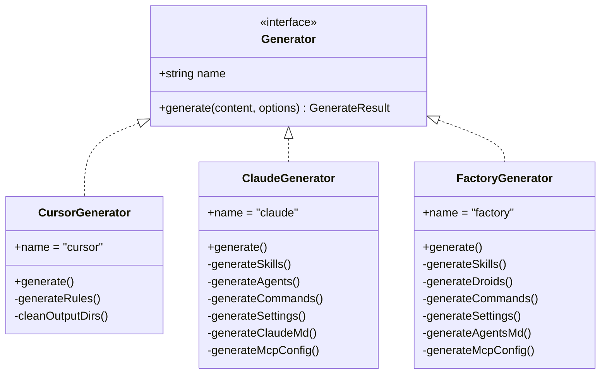
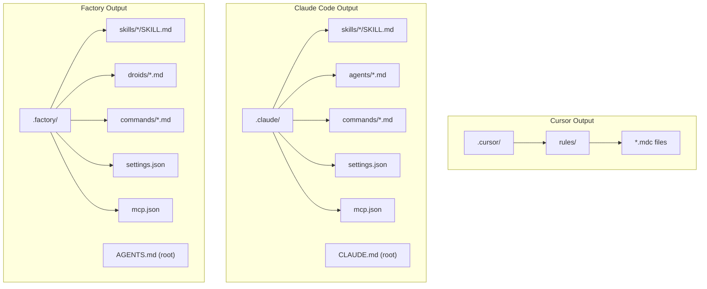
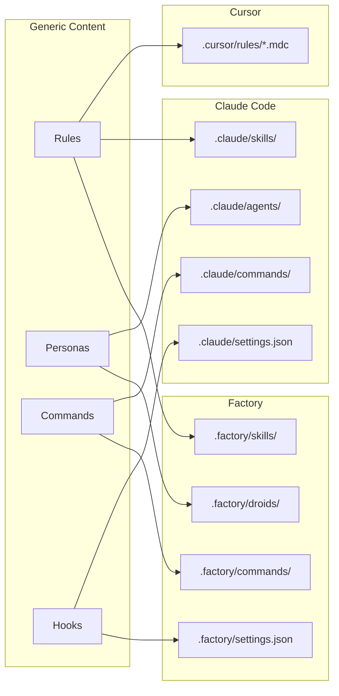
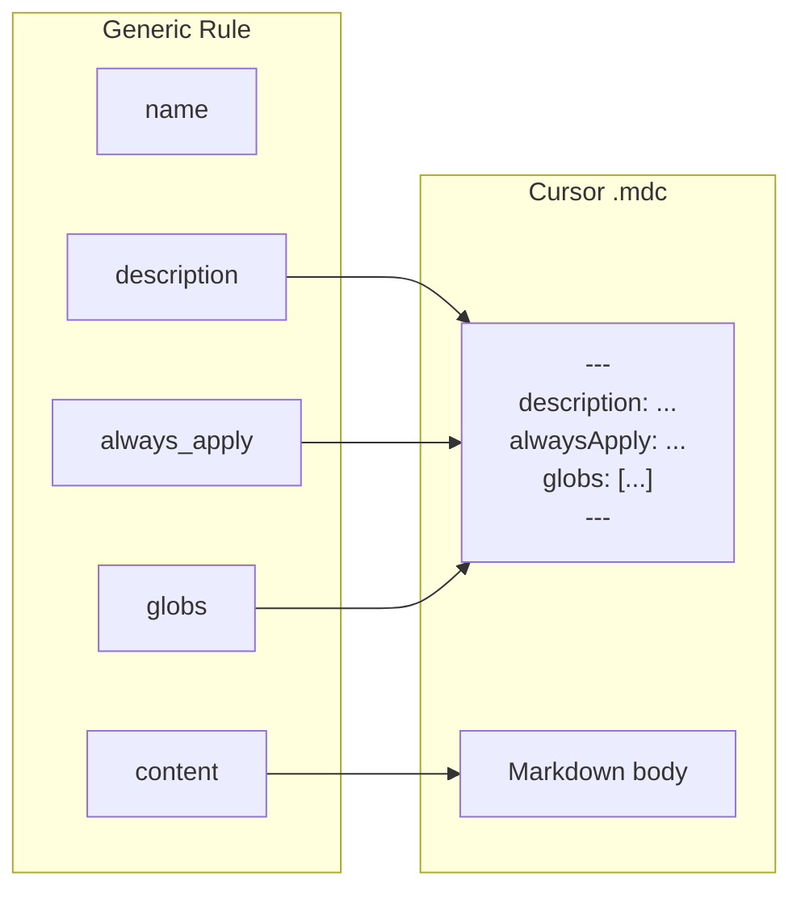
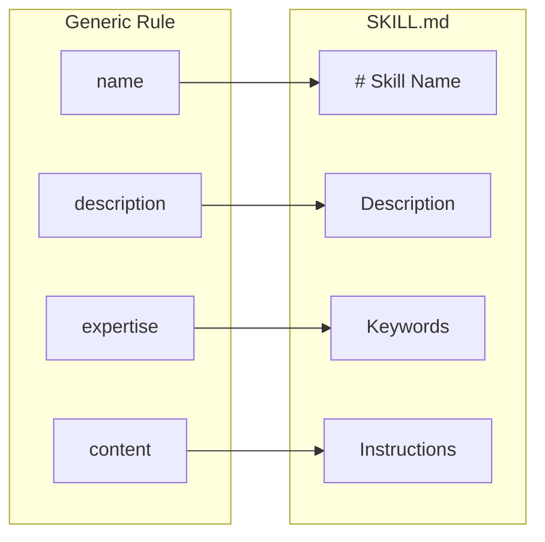
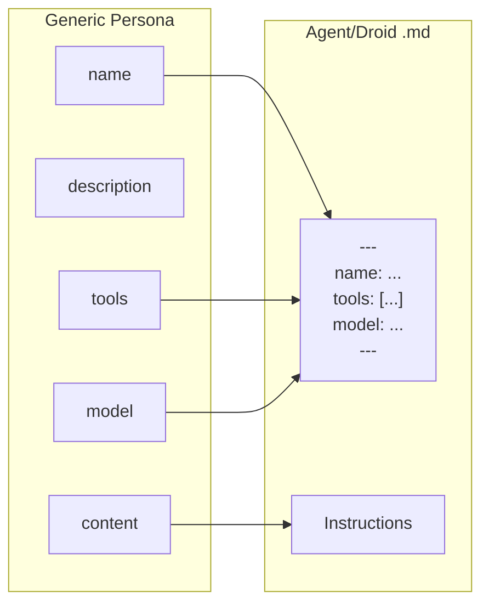

# Generator Architecture

This document describes the generator system that produces platform-specific output files.

## Generator Interface

All generators implement a common interface:

```text
                    ┌─────────────────────────────────┐
                    │      Generator (interface)      │
                    ├─────────────────────────────────┤
                    │ + name: TargetType              │
                    │ + generate(content, options):   │
                    │     Promise<GenerateResult>     │
                    └───────────────┬─────────────────┘
                                    │
        ┌───────────────────────────┼───────────────────────────┐
        │                           │                           │
        ▼                           ▼                           ▼
┌───────────────────┐   ┌───────────────────┐   ┌───────────────────┐
│  CursorGenerator  │   │  ClaudeGenerator  │   │ FactoryGenerator  │
├───────────────────┤   ├───────────────────┤   ├───────────────────┤
│ name = "cursor"   │   │ name = "claude"   │   │ name = "factory"  │
├───────────────────┤   ├───────────────────┤   ├───────────────────┤
│ - generateRules() │   │ - generateSkills()│   │ - generateSkills()│
│ - cleanOutputDirs │   │ - generateAgents()│   │ - generateDroids()│
│                   │   │ - generateCmds()  │   │ - generateCmds()  │
│                   │   │ - generateSettings│   │ - generateSettings│
│                   │   │ - generateClaudeMd│   │ - generateAgentsMd│
│                   │   │ - generateMcp()   │   │ - generateMcp()   │
└───────────────────┘   └───────────────────┘   └───────────────────┘
```



## Output Structure by Platform

```text
CURSOR OUTPUT                 CLAUDE OUTPUT                FACTORY OUTPUT
─────────────                 ─────────────                ──────────────
.cursor/                      .claude/                     .factory/
└── rules/                    ├── skills/                  ├── skills/
    ├── rule1.mdc             │   ├── skill1/              │   ├── skill1/
    ├── rule2.mdc             │   │   └── SKILL.md         │   │   └── SKILL.md
    └── rule3.mdc             │   └── skill2/              │   └── skill2/
                              │       └── SKILL.md         │       └── SKILL.md
                              ├── agents/                  ├── droids/
                              │   ├── architect.md         │   ├── architect.md
                              │   └── implementer.md       │   └── implementer.md
                              ├── commands/                ├── commands/
                              │   └── lint-fix.md          │   └── lint-fix.md
                              ├── settings.json            ├── settings.json
                              └── mcp.json                 └── mcp.json
                              
CLAUDE.md (project root)      AGENTS.md (project root)
```



## Content Mapping

```text
              GENERIC CONTENT                    PLATFORM OUTPUT
    ┌─────────────────────────────┐
    │           Rules             │
    └──────────────┬──────────────┘
                   │
    ┌──────────────┼──────────────┬─────────────────────┐
    │              │              │                     │
    ▼              ▼              ▼                     │
.cursor/       .claude/       .factory/                 │
rules/*.mdc    skills/*/      skills/*/                 │
               SKILL.md       SKILL.md                  │
                                                        │
    ┌─────────────────────────────┐                     │
    │         Personas            │                     │
    └──────────────┬──────────────┘                     │
                   │                                    │
    ┌──────────────┴──────────────┐                     │
    │                             │                     │
    ▼                             ▼                     │
.claude/                      .factory/                 │
agents/*.md                   droids/*.md               │
                                                        │
    ┌─────────────────────────────┐                     │
    │         Commands            │                     │
    └──────────────┬──────────────┘                     │
                   │                                    │
    ┌──────────────┴──────────────┐                     │
    │                             │                     │
    ▼                             ▼                     │
.claude/                      .factory/                 │
commands/*.md                 commands/*.md             │
                                                        │
    ┌─────────────────────────────┐                     │
    │           Hooks             │                     │
    └──────────────┬──────────────┘                     │
                   │                                    │
    ┌──────────────┴──────────────┐                     │
    │                             │                     │
    ▼                             ▼                     │
.claude/                      .factory/                 │
settings.json                 settings.json             │
(hooks section)               (hooks section)           │
```



## Generator Options

```typescript
interface GeneratorOptions {
  outputDir?: string;      // Output directory (defaults to project root)
  clean?: boolean;         // Clean existing files before generating
  addHeaders?: boolean;    // Add "do not edit" headers
  dryRun?: boolean;        // Don't write files
  verbose?: boolean;       // Verbose output
}
```

## GenerateResult Structure

```typescript
interface GenerateResult {
  files: string[];         // Files created or updated
  deleted: string[];       // Files deleted (if clean mode)
  warnings: string[];      // Warnings encountered
  generated?: GeneratedFile[]; // File contents (for dry-run)
}

interface GeneratedFile {
  path: string;            // Relative path from output directory
  content: string;         // File content
  type: 'rule' | 'persona' | 'command' | 'hook' | 'config' | 'entrypoint';
}
```

## Platform-Specific Transformations

### Cursor Rules (.mdc)

```text
GENERIC RULE                              CURSOR .mdc OUTPUT
─────────────                             ──────────────────
┌─────────────────────┐                   ┌─────────────────────┐
│ name: my-rule       │                   │ ---                 │
│ description: ...    │─────────────────▶ │ description: ...    │
│ always_apply: true  │                   │ alwaysApply: true   │
│ globs: ['*.ts']     │                   │ globs:              │
│ ---                 │                   │   - "*.ts"          │
│ Content body        │                   │ ---                 │
└─────────────────────┘                   │ Content body        │
                                          └─────────────────────┘
```



### Claude/Factory Skills

```text
GENERIC PERSONA                           AGENT/DROID OUTPUT
───────────────                           ──────────────────
┌─────────────────────┐                   ┌─────────────────────┐
│ name: architect     │                   │ ---                 │
│ tools: [read, write]│─────────────────▶ │ name: architect     │
│ model: powerful     │                   │ tools:              │
│ ---                 │                   │   - Read            │
│ Instructions...     │                   │   - Write           │
└─────────────────────┘                   │ model: claude-opus..│
                                          │ ---                 │
                                          │ Instructions...     │
                                          └─────────────────────┘
```



### Claude/Factory Personas


