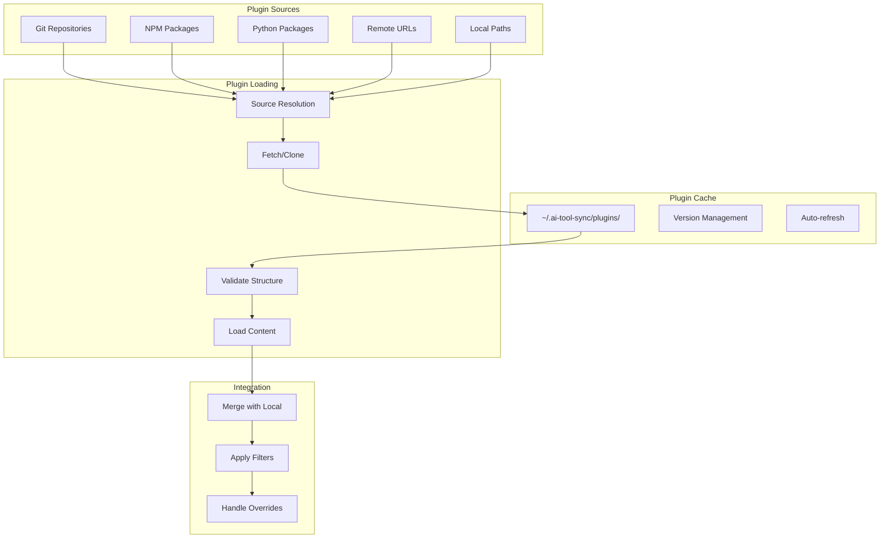
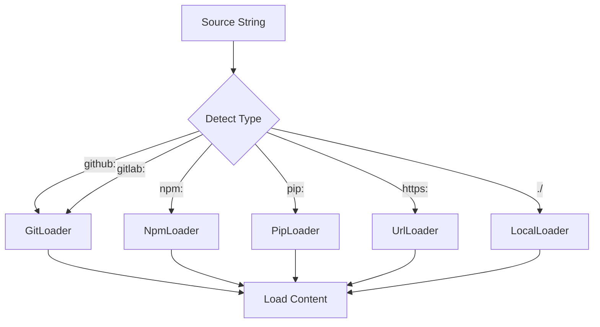
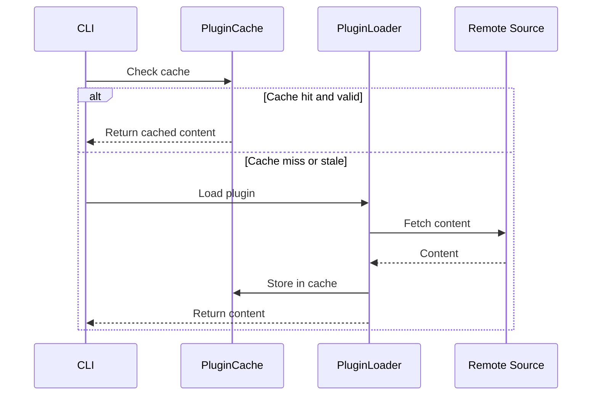
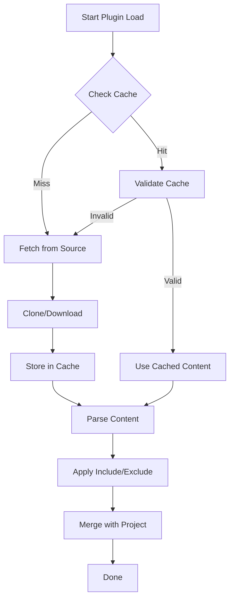

# Plugin System Architecture

This document describes how the plugin system works in ai-tool-sync.

## Plugin Overview

Plugins allow external sources of rules, personas, commands, and hooks to be integrated into a project.

```text
                              PLUGIN SOURCES
    ┌───────────────┬───────────────┬───────────────┬───────────────┐
    │ Git Repos     │ NPM Packages  │Python Packages│ Remote URLs   │
    │ (github:)     │ (npm:)        │ (pip:)        │ (https:)      │
    └───────┬───────┴───────┬───────┴───────┬───────┴───────┬───────┘
            │               │               │               │
            └───────────────┴───────┬───────┴───────────────┘
                                    │
                                    ▼
                    ┌───────────────────────────────┐
                    │       SOURCE RESOLUTION       │
                    │   (detect loader by prefix)   │
                    └───────────────┬───────────────┘
                                    │
                                    ▼
                    ┌───────────────────────────────┐
                    │         FETCH/CLONE           │
                    │    (download to cache)        │
                    └───────────────┬───────────────┘
                                    │
                                    ▼
                    ┌───────────────────────────────┐
                    │         PLUGIN CACHE          │
                    │   ~/.ai-tool-sync/plugins/    │
                    │   • Version management        │
                    │   • Auto-refresh              │
                    └───────────────┬───────────────┘
                                    │
                                    ▼
                    ┌───────────────────────────────┐
                    │     VALIDATE & LOAD           │
                    │   • Check structure           │
                    │   • Parse content             │
                    └───────────────┬───────────────┘
                                    │
                                    ▼
                    ┌───────────────────────────────┐
                    │        INTEGRATION            │
                    │   • Merge with local          │
                    │   • Apply include/exclude     │
                    │   • Handle overrides          │
                    └───────────────────────────────┘
```



## Plugin Configuration

```yaml
use:
  plugins:
    - name: typescript-rules
      source: github:company/ts-rules
      version: v2.0.0
      enabled: true
      include:
        - "rules/*"
        - "personas/architect.md"
      exclude:
        - "rules/legacy-*"
    
    - name: security-policies
      source: npm:@company/security-rules
      version: ^1.0.0
      enabled: true
```

## Source Resolution

```text
                        SOURCE STRING
                             │
                             ▼
               ┌─────────────────────────────┐
               │      DETECT PREFIX          │
               └─────────────┬───────────────┘
                             │
    ┌────────────┬───────────┼───────────┬────────────┐
    │            │           │           │            │
    ▼            ▼           ▼           ▼            ▼
"github:"    "gitlab:"    "npm:"     "pip:"      "https:"
"git:"                                            "./"
    │            │           │           │            │
    ▼            ▼           ▼           ▼            ▼
┌─────────┐ ┌─────────┐ ┌─────────┐ ┌─────────┐ ┌─────────┐
│   Git   │ │   Git   │ │   NPM   │ │   Pip   │ │  URL/   │
│ Loader  │ │ Loader  │ │ Loader  │ │ Loader  │ │ Local   │
└────┬────┘ └────┬────┘ └────┬────┘ └────┬────┘ └────┬────┘
     │           │           │           │            │
     └───────────┴───────────┴─────┬─────┴────────────┘
                                   │
                                   ▼
                          ┌───────────────┐
                          │ Load Content  │
                          └───────────────┘
```



## Plugin Directory Structure

```text
plugin-root/
├── manifest.yaml          # Optional plugin metadata
├── policies/              # Policy rules (must-do)
│   └── *.md
├── skills/                # Skill rules (can-do)
│   └── *.md
├── rules/                 # Alternative rules location
│   └── *.md
├── personas/
│   └── *.md
├── commands/
│   └── *.md
└── hooks/
    └── *.md
```

## Caching Strategy

```text
CLI                 PluginCache              PluginLoader            Remote Source
 │                      │                        │                        │
 │  Check cache         │                        │                        │
 │─────────────────────▶│                        │                        │
 │                      │                        │                        │
 │  ┌─────────────────────────────────────────────────────────────────┐  │
 │  │ IF cache hit AND valid:                                         │  │
 │  │                                                                 │  │
 │  │   Return cached   │                        │                    │  │
 │  │◀──────────────────│                        │                    │  │
 │  │                                                                 │  │
 │  └─────────────────────────────────────────────────────────────────┘  │
 │                      │                        │                        │
 │  ┌─────────────────────────────────────────────────────────────────┐  │
 │  │ ELSE (cache miss or stale):                                     │  │
 │  │                   │                        │                    │  │
 │  │   Load plugin     │                        │                    │  │
 │  │ ──────────────────────────────────────────▶│                    │  │
 │  │                   │                        │                    │  │
 │  │                   │                        │  Fetch content     │  │
 │  │                   │                        │───────────────────▶│  │
 │  │                   │                        │                    │  │
 │  │                   │                        │◀───────────────────│  │
 │  │                   │                        │                    │  │
 │  │                   │   Store in cache       │                    │  │
 │  │                   │◀───────────────────────│                    │  │
 │  │                   │                        │                    │  │
 │  │   Return content  │                        │                    │  │
 │  │◀──────────────────────────────────────────│                    │  │
 │  │                                                                 │  │
 │  └─────────────────────────────────────────────────────────────────┘  │
```



## Version Specifications

| Version Spec | Behavior |
|--------------|----------|
| `v1.0.0` | Exact version tag |
| `^1.0.0` | Compatible version (semver) |
| `~1.0.0` | Patch updates only |
| `latest` | Latest available |
| `main` | Git branch name |
| `abc123` | Git commit hash |

## Plugin Load Sequence

```text
┌─────────────────┐
│  Start Plugin   │
│     Load        │
└────────┬────────┘
         │
         ▼
┌─────────────────┐     ┌─────────────────┐
│  Check Cache    │────▶│   Cache Hit?    │
└─────────────────┘     └────────┬────────┘
                                 │
                    ┌────────────┴────────────┐
                    │                         │
                   YES                        NO
                    │                         │
                    ▼                         ▼
           ┌───────────────┐         ┌───────────────┐
           │Validate Cache │         │Fetch from     │
           │  (version)    │         │Source         │
           └───────┬───────┘         └───────┬───────┘
                   │                         │
              ┌────┴────┐                    │
              │         │                    │
            Valid    Invalid                 │
              │         │                    │
              │         └────────────────────┤
              │                              │
              ▼                              ▼
     ┌───────────────┐              ┌───────────────┐
     │ Use Cached    │              │ Store in      │
     │ Content       │              │ Cache         │
     └───────┬───────┘              └───────┬───────┘
             │                              │
             └──────────────┬───────────────┘
                            │
                            ▼
                   ┌───────────────┐
                   │ Parse Content │
                   └───────┬───────┘
                           │
                           ▼
                   ┌───────────────┐
                   │Apply Include/ │
                   │Exclude Filters│
                   └───────┬───────┘
                           │
                           ▼
                   ┌───────────────┐
                   │ Merge with    │
                   │ Project       │
                   └───────┬───────┘
                           │
                           ▼
                   ┌───────────────┐
                   │     Done      │
                   └───────────────┘
```


