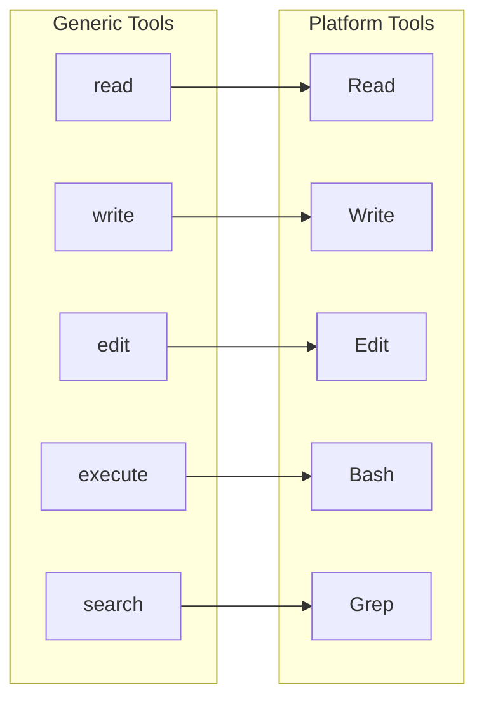
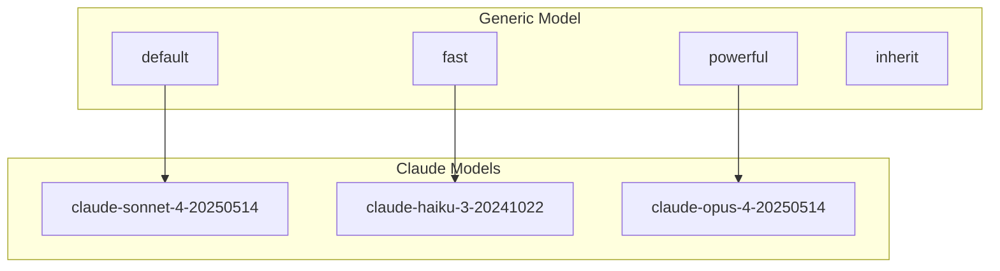
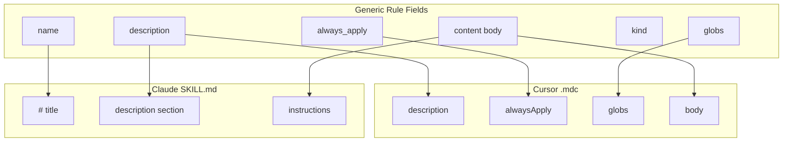
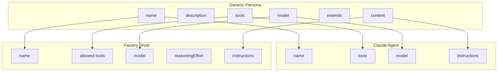
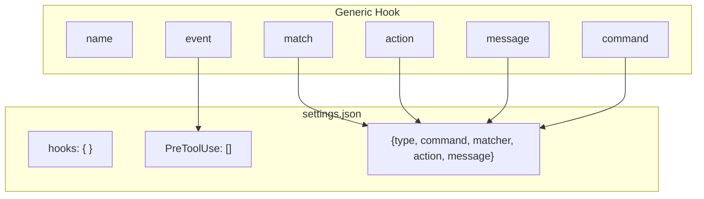
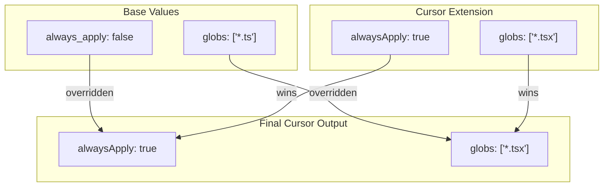

# Content Transformation Rules

This document describes how generic content is transformed for each target platform.

## Tool Mapping

Tools are mapped between the generic format and platform-specific names:

| Generic | Cursor | Claude | Factory |
|---------|--------|--------|---------|
| read | Read | Read | Read |
| write | Write | Write | Write |
| edit | Edit | Edit | Edit |
| execute | Bash | Bash | Bash |
| search | Grep | Grep | Grep |
| glob | Glob | Glob | Glob |
| fetch | - | WebFetch | WebFetch |
| ls | - | ListDir | ListDir |

```text
GENERIC TOOLS                           PLATFORM TOOLS
─────────────                           ──────────────
┌────────────┐                          ┌────────────┐
│   read     │─────────────────────────▶│    Read    │
└────────────┘                          └────────────┘
┌────────────┐                          ┌────────────┐
│   write    │─────────────────────────▶│   Write    │
└────────────┘                          └────────────┘
┌────────────┐                          ┌────────────┐
│   edit     │─────────────────────────▶│    Edit    │
└────────────┘                          └────────────┘
┌────────────┐                          ┌────────────┐
│  execute   │─────────────────────────▶│    Bash    │
└────────────┘                          └────────────┘
┌────────────┐                          ┌────────────┐
│   search   │─────────────────────────▶│    Grep    │
└────────────┘                          └────────────┘
┌────────────┐                          ┌────────────┐
│    glob    │─────────────────────────▶│    Glob    │
└────────────┘                          └────────────┘
┌────────────┐                          ┌────────────┐
│   fetch    │─────────────────────────▶│  WebFetch  │  (Claude/Factory only)
└────────────┘                          └────────────┘
┌────────────┐                          ┌────────────┐
│     ls     │─────────────────────────▶│  ListDir   │  (Claude/Factory only)
└────────────┘                          └────────────┘
```



## Model Mapping

| Generic | Claude | Factory |
|---------|--------|---------|
| default | claude-sonnet-4-20250514 | (platform default) |
| fast | claude-haiku-3-20241022 | (fast model) |
| powerful | claude-opus-4-20250514 | (powerful model) |
| inherit | (from parent) | (from parent) |

```text
GENERIC MODEL                           CLAUDE MODEL
─────────────                           ────────────
┌────────────┐                          ┌──────────────────────────┐
│  default   │─────────────────────────▶│ claude-sonnet-4-20250514 │
└────────────┘                          └──────────────────────────┘
┌────────────┐                          ┌──────────────────────────┐
│    fast    │─────────────────────────▶│ claude-haiku-3-20241022  │
└────────────┘                          └──────────────────────────┘
┌────────────┐                          ┌──────────────────────────┐
│  powerful  │─────────────────────────▶│ claude-opus-4-20250514   │
└────────────┘                          └──────────────────────────┘
┌────────────┐                          ┌──────────────────────────┐
│  inherit   │─────────────────────────▶│     (from parent)        │
└────────────┘                          └──────────────────────────┘
```



## Rule Transformation

```text
                    GENERIC RULE
    ┌───────────────────────────────────────────┐
    │ name: my-rule                             │
    │ description: A helpful rule               │
    │ always_apply: true                        │
    │ globs: ['*.ts', '*.tsx']                  │
    │ kind: policy                              │
    │ ---                                       │
    │ # Rule Content                            │
    │ Follow these guidelines...                │
    └─────────────────────┬─────────────────────┘
                          │
        ┌─────────────────┼─────────────────┐
        │                 │                 │
        ▼                 ▼                 ▼
  ┌───────────┐    ┌───────────┐    ┌───────────┐
  │  CURSOR   │    │  CLAUDE   │    │  FACTORY  │
  └─────┬─────┘    └─────┬─────┘    └─────┬─────┘
        │                │                │
        ▼                ▼                ▼
┌─────────────────┐ ┌─────────────────┐ ┌─────────────────┐
│.cursor/rules/   │ │.claude/skills/  │ │.factory/skills/ │
│my-rule.mdc      │ │my-rule/SKILL.md │ │my-rule/SKILL.md │
├─────────────────┤ ├─────────────────┤ ├─────────────────┤
│---              │ │# my-rule        │ │# my-rule        │
│description: ... │ │                 │ │                 │
│alwaysApply: true│ │A helpful rule   │ │A helpful rule   │
│globs:           │ │                 │ │                 │
│  - "*.ts"       │ │## Instructions  │ │## Instructions  │
│  - "*.tsx"      │ │Follow these...  │ │Follow these...  │
│---              │ │                 │ │                 │
│# Rule Content   │ │                 │ │                 │
│Follow these...  │ │                 │ │                 │
└─────────────────┘ └─────────────────┘ └─────────────────┘
```



## Persona Transformation

```text
                    GENERIC PERSONA
    ┌───────────────────────────────────────────┐
    │ name: architect                           │
    │ description: System design expert         │
    │ tools: [read, write, search]              │
    │ model: powerful                           │
    │ ---                                       │
    │ You are an expert system architect...     │
    └─────────────────────┬─────────────────────┘
                          │
                ┌─────────┴─────────┐
                │                   │
                ▼                   ▼
          ┌───────────┐       ┌───────────┐
          │  CLAUDE   │       │  FACTORY  │
          └─────┬─────┘       └─────┬─────┘
                │                   │
                ▼                   ▼
    ┌─────────────────────┐ ┌─────────────────────┐
    │.claude/agents/      │ │.factory/droids/     │
    │architect.md         │ │architect.md         │
    ├─────────────────────┤ ├─────────────────────┤
    │---                  │ │---                  │
    │name: architect      │ │name: architect      │
    │tools:               │ │allowed-tools:       │
    │  - Read             │ │  - Read             │
    │  - Write            │ │  - Write            │
    │  - Grep             │ │  - Grep             │
    │model: claude-opus...│ │model: ...           │
    │---                  │ │reasoningEffort: high│
    │You are an expert... │ │---                  │
    │                     │ │You are an expert... │
    └─────────────────────┘ └─────────────────────┘
```



## Hook Transformation

Hooks are only supported by Claude Code and Factory:

```text
                      GENERIC HOOK
    ┌───────────────────────────────────────────┐
    │ name: block-dangerous                     │
    │ event: PreToolUse                         │
    │ match: Bash(*rm -rf*)                     │
    │ action: block                             │
    │ message: Dangerous command blocked        │
    └─────────────────────┬─────────────────────┘
                          │
                ┌─────────┴─────────┐
                │                   │
                ▼                   ▼
          ┌───────────┐       ┌───────────┐
          │  CLAUDE   │       │  FACTORY  │
          └─────┬─────┘       └─────┬─────┘
                │                   │
                ▼                   ▼
    ┌─────────────────────┐ ┌─────────────────────┐
    │.claude/settings.json│ │.factory/settings.json
    ├─────────────────────┤ ├─────────────────────┤
    │{                    │ │{                    │
    │  "hooks": {         │ │  "hooks": {         │
    │    "PreToolUse": [  │ │    "PreToolUse": [  │
    │      {              │ │      {              │
    │        "matcher":   │ │        "matcher":   │
    │          "Bash(*rm  │ │          "Bash(*rm  │
    │            -rf*)",  │ │            -rf*)",  │
    │        "action":    │ │        "action":    │
    │          "block",   │ │          "block",   │
    │        "message":   │ │        "message":   │
    │          "Dangerous │ │          "Dangerous │
    │           command"  │ │           command"  │
    │      }              │ │      }              │
    │    ]                │ │    ]                │
    │  }                  │ │  }                  │
    │}                    │ │}                    │
    └─────────────────────┘ └─────────────────────┘
```



## Entry Point Generation

### CLAUDE.md Structure

```text
┌─────────────────────────────────────────────────────────────────┐
│ <!-- Auto-generated by ai-tool-sync -->                         │
│                                                                 │
│ # Project Name                                                  │
│                                                                 │
│ Project description from config.yaml                            │
│                                                                 │
│ ## Skills                                                       │
│                                                                 │
│ - **skill-name** - Description of the skill                     │
│ - **another-skill** - Another description                       │
│                                                                 │
│ ## Agents                                                       │
│                                                                 │
│ - **architect** - System design expert                          │
│ - **implementer** - Code implementation specialist              │
│                                                                 │
│ ## Commands                                                     │
│                                                                 │
│ - **/lint-fix** - Run linting and auto-fix issues               │
│ - **/type-check** - Run TypeScript type checking                │
│                                                                 │
└─────────────────────────────────────────────────────────────────┘
```

```markdown
<!-- Auto-generated by ai-tool-sync -->

# Project Name

[Project description from config]

## Skills

- skill-name - Description of the skill

## Agents

- agent-name - Description of the agent

## Commands

- /command-name - Description of the command
```

### AGENTS.md Structure (Factory)

```text
┌─────────────────────────────────────────────────────────────────┐
│ <!-- Auto-generated by ai-tool-sync -->                         │
│                                                                 │
│ # Project Name                                                  │
│                                                                 │
│ Project description from config.yaml                            │
│                                                                 │
│ ## Skills                                                       │
│                                                                 │
│ - **skill-name** - Description                                  │
│                                                                 │
│ ## Droids                                                       │
│                                                                 │
│ - **architect** - System design expert                          │
│ - **implementer** - Code implementation specialist              │
│                                                                 │
│ ## Commands                                                     │
│                                                                 │
│ - **/lint-fix** - Run linting and auto-fix                      │
│                                                                 │
└─────────────────────────────────────────────────────────────────┘
```

```markdown
<!-- Auto-generated by ai-tool-sync -->

# Project Name

[Project description from config]

## Skills

- skill-name - Description

## Droids

- droid-name - Description

## Commands

- /command-name - Description
```

## Platform Extension Overrides

Each content type can have platform-specific overrides that take precedence:

```text
                    BASE VALUES                    CURSOR EXTENSION
    ┌───────────────────────────────┐    ┌───────────────────────────────┐
    │ always_apply: false           │    │ cursor:                       │
    │ globs: ['*.ts']               │    │   alwaysApply: true           │
    │                               │    │   globs: ['*.tsx']            │
    └───────────────┬───────────────┘    └───────────────┬───────────────┘
                    │                                    │
                    │         MERGE (extension wins)     │
                    └────────────────┬───────────────────┘
                                     │
                                     ▼
                    ┌───────────────────────────────────────┐
                    │        FINAL CURSOR OUTPUT            │
                    ├───────────────────────────────────────┤
                    │ alwaysApply: true   ◀── from extension│
                    │ globs: ['*.tsx']    ◀── from extension│
                    └───────────────────────────────────────┘
```


